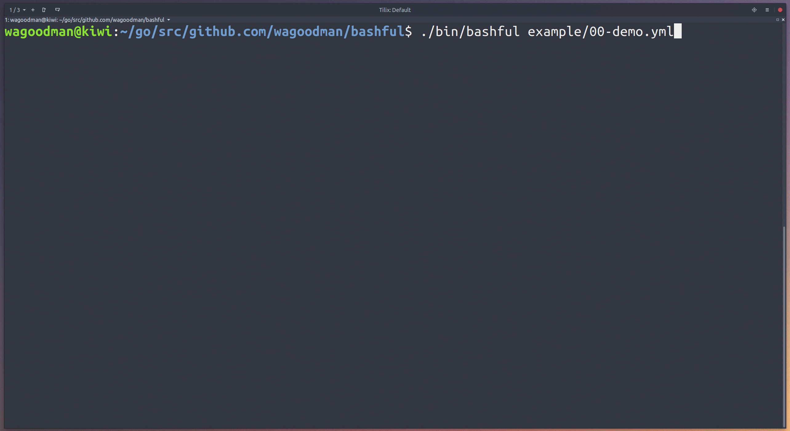

# bashful

[](https://travis-ci.org/wagoodman/bashful) [](https://goreportcard.com/report/github.com/wagoodman/bashful)

**This is beta quality!** Use at your own risk.

Use a yaml file to stitch together commands and bash snippets and run them with a bit of style. 
Why? Because your bash script should be quiet and shy-like (...and not such a loud mouth). 



*"But why would you make this monstrosity?"* you ask... because ` &>/dev/null` and ` | tee -a some.log` and `set -e; do something; set +e` and other similar things is getting annoying. And besides... why shouldn't your bash script output look pretty?

**Features:**
- [x] Run bash snippits ('tasks') in series or parallel
- [x] A nice vertical progress bar to show current task status (with inline realtime stdout/stderr)
- [x] Download url references to bash scripts and executables
- [x] Bundle set of scripts and listed resources into a single simi-portable executable
- [x] Log all task stdout/stderr to a log file
- [x] ETA for running tasks (that have already been run before)
- [x] Configuration yaml block to control the behavior/look & feel
- [x] Detailed error reports when commands fail
- [x] Control which failing command should halt execution

## Installation

**Ubuntu/Debian**
```bash
wget https://github.com/wagoodman/bashful/releases/download/v0.0.10/bashful_0.0.10_linux_amd64.deb
sudo apt install ./bashful_0.0.10_linux_amd64.deb
```

**RHEL/Centos**
```bash
wget https://github.com/wagoodman/bashful/releases/download/v0.0.10/bashful_0.0.10_linux_amd64.rpm
rpm -i bashful_0.0.10_linux_amd64.rpm
```

**Mac**
```bash
brew tap wagoodman/bashful
brew install bashful
```
or download a Darwin build from the releases page.

**Go tools**
```bash
go get github.com/wagoodman/bashful
```

## Getting Started
**There are a ton of examples in the [`example/`](https://github.com/wagoodman/bashful/tree/master/example) dir**, but here are a few:

**1. The simplest of examples:**
```yaml
tasks:
    - cmd: echo "Hello, World!"
```
To run it:
```bash
bashful run hello.yaml
```

**2. A more realistic example: a build and deployment description**
```yaml
# ci.yaml
tasks:
    - name: Building app
      cmd: go build -ldflags '-linkmode external -extldflags -static -s'
      tags: build

    - name: Packaging app
      cmd: docker build -t my-awesome-app:v1 .
      tags: build

    - name: Publishing image
      cmd: docker push my-awesome-app:v1
      tags: deploy

    - name: Deploying app
      cmd: kubectl run my-awesome-app --image=docker.io/wagoodman/my-awesome-app:v1 --pt=80
      tags: deploy
```

Run all of the tasks...
```bash
bashful run ci.yaml
```

...Or run just the build steps:
```bash
bashful run ci.yaml --tags build
```

**3. Have an installer run things in parallel...**
```yaml
# install.yaml
tasks:
    - name: Installing bridgy
      parallel-tasks: 
        - cmd: sudo apt-get install -y tmux sshfs
        - cmd: pip install --user bridgy
```

...Or make an installer that downloads and runs everything it needs:
```yaml
# install.yaml
tasks:
    # The given url gets executed by default
    - name: Installing Cuda and Bazel
      url: https://raw.githubusercontent.com/jasimpson/tensorflow-on-aws/master/toa_part_1of2.sh

    # Or you can control how the url asset (<exec>) gets used
    - name: Installing Tensorflow
      url: https://raw.githubusercontent.com/jasimpson/tensorflow-on-aws/master/toa_part_2of2.sh
      cmd: source ~/.bashrc && <exec>
```

Package up the installed into a single executable and give it to someone else to run (must be the same architecture and OS type):
```bash
bashful bundle install.yaml
# now you have a new executable called "install.bundle", which can simply be executed
./install.bundle
```
*Note: the bundle feature is pretty experimental right now.*

You can even persist environment variables across tasks:
```yaml
tasks:
  - cmd: export VAR1=isnowset
  - cmd: eval "export VAR2=isnowreallyset"
  - cmd: echo ${VAR1} ${VAR2}
```
*Note: you cannot persist environment variables from a parallel step.*


**4. Include other yaml files in your bashful run.yaml.**
This way you can centralize your common yaml snippets for reusability:

```yaml
# run.yaml

$include: example/common-config.yml

x-reference-data:
  all-apps: &app-names
    - $include example/common-apps.yml

tasks:

  - name: Cloning Repos
    parallel-tasks:
      - name: "Cloning <replace>"
        cmd: example/scripts/random-worker.sh 2 <replace>
        ignore-failure: true
        for-each: *app-names

  - name: Building Repos
    parallel-tasks:
      - name: "Building <replace>"
        cmd: example/scripts/random-worker.sh 1 <replace>
        ignore-failure: true
        for-each: *app-names

```

```yaml
# example/common-config.yml

config:
  show-failure-report: false
  show-summary-errors: true
  max-parallel-commands: 6
  show-task-times: true
```

```yaml
# example/common-apps.yml

- some-lib-4
- utilities-lib
- important-lib
- some-app1
- some-app3
```

Will generate:
```yaml
config:
    show-failure-report: false
    show-summary-errors: true
    max-parallel-commands: 6
    show-task-times: true

x-reference-data:
  all-apps: &app-names
    - some-lib-4
    - utilities-lib
    - important-lib
    - some-app1
    - some-app3

tasks:

  - name: Cloning Repos
    parallel-tasks:
      - name: "Cloning <replace>"
        cmd: example/scripts/random-worker.sh 2 <replace>
        ignore-failure: true
        for-each: *app-names

  - name: Building Repos
    parallel-tasks:
      - name: "Building <replace>"
        cmd: example/scripts/random-worker.sh 1 <replace>
        ignore-failure: true
        for-each: *app-names
```

**There are a ton of examples in the [`example/`](https://github.com/wagoodman/bashful/tree/master/example) dir.** Go check them out!

## Configuration Options
Here is an exhaustive list of all of the config options (in the `config` yaml block). These options
are global options that apply to all tasks within the yaml file:
```yaml

# this block is used to configure the look, feel, and behavior of all tasks
config:
    # which character used to delimintate the task list
    bullet-char: "-"

    # hide all child tasks after task section completion
    collapse-on-completion: false

    # change the colors of the vertical progress bar for a task in a particular state.
    # this should be a number from the 256 color palette.
    success-status-color: 10
    running-status-color: 22
    pending-status-color: 22
    error-status-color: 160

    # by default the screen is updated when an event occurs (when stdout from
    # a running process is read). This can be changed to only allow the 
    # screen to be updated on an interval (to accomodate slower devices).
    event-driven: false

    # This is the character/string that is replaced in the cmd section of a task to reference a downloaded url
    exec-replace-pattern: '<exec>'

    # the number of tasks that can run simultaneously
    max-parallel-commands: 4

    # log all task output and events to the given logfile
    log-path: path/to/file.log

    # show/hide the detailed summary of all task failures after completion
    show-failure-report: true

    # show/hide the last summary line (showing % complete, number of tasks ran, eta, etc)
    show-summary-footer: true

    # show/hide the number of tasks that have failed in the summary footer line
    show-summary-errors: false

    # show/hide the number of tasks completed thus far on the summary footer line
    show-summary-steps: true

    # show/hide the eta and runtime figures on the summary footer line
    show-summary-times: false

    # globally enable/disable showing the stdout/stderr of each task
    show-task-output: true

    # Show an eta for each task on the screen (being shown on every line with a command running)
    show-task-times: true

    # Show only one line of output to the screen (instead of a line per task + a summary line)
    single-line: true

    # globally enable/disable haulting further execution when any one task fails
    stop-on-failure: true

    # This is the character/string that is replaced with items listed in the 'for-each' block
    replica-replace-pattern: '<replace>'

    # time in milliseconds to update each task on the screen (polling interval)
    update-interval: 250
```

The `tasks` block is an ordered list of processes to run. Each task has several options that can be configured:
```yaml
tasks:
    - name: my awesome command      # a title for the task
      cmd: echo "woot"              # the command to be ran (required)
      
      collapse-on-completion: false # hide all defined 'parallel-tasks' after completion
      event-driven: true            # use a event driven or polling mechanism for displaying task stdout
      ignore-failure: false         # do not register any non-zero return code as a failure (this task will appear to never fail)
      show-output: true             # show task stdout to the screen
      stop-on-failure: true         # indicate if the application should continue if this cmd fails 
      
      parallel-tasks: ...           # a list of tasks that should be performed concurrently
      
      for-each: ...                 # a list of parameters used to duplicate this task
      
      url: http://github.com/somescript.sh # download this url and execute it
      md5: ae8abe98aeb389ae8b39e3434bbc    # an expected md5 checksum of the url provided

      tags: something               # one or more 'tags' that can be used to execute a sub-selection of tasks within a run yaml
      tags:                         # e.g. 'bashful run some.yaml --tags      something' 
        - something                 #      'bashful run some.yaml --tags      something,else'
        - else                      #      'bashful run some.yaml --only-tags something'
```

**There are a ton of examples in the [`example/`](https://github.com/wagoodman/bashful/tree/master/example) dir.** Go check them out!

## Runtime Options
```
USAGE:
   bashful run [options] <path-to-yaml-file>
   bashful bundle <path-to-yaml-file>

COMMANDS:
     bundle   Bundle yaml and referenced url resources into a single executable
     run      Execute the given yaml

BUNDLE OPTIONS:
    None

RUN OPTIONS:
   --tags value       A comma delimited list of matching task tags. 
                      If a task's tag matches *or if it is not tagged* then it will be executed (also see --only-tags).
   --only-tags value  A comma delimited list of matching task tags. A task will only be executed if it has a matching tag.

GLOBAL OPTIONS:
   --help, -h     show help
   --version, -v  print the version
```

## Wish list
All feature requests are welcome! 
- [ ] at least 70% test coverage
- [ ] truly cross platform (windows)
- [ ] Multiple (serial) commands for a single task (`cmd: [run something, run another thing]`)
- [ ] Multiple url references for a single task (`url: [https://someurl.com/some-script.sh, https://anotherurl.com/another-script.sh]`)
- [ ] Allow parallel tasks within parallel tasks (really just allow deeper nesting of any kind of task)
- [ ] Interact with the mouse to see more/less tasks (https://godoc.org/github.com/nsf/termbox-go#Event)
